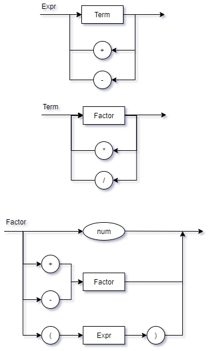

# Compilador

*Ultima atualizacao README.md: 04/03*

#### Calculadora de terminal em python

Operadores disponíveis:
- "+"
- "-"
- "*"
- "/"

Exemplo de uso:
> python compilador.py "1 + 10 - 2  \* 5"

Diagrama sintático:



EBNF:
```
EXPR = TERM, {("+"|"-"), TERM}
TERM = FACT, {("*"|"/"), FACT}
FACT = ( num | (("+"|"-"), FACT) | ( "(", EXPR, ")" ) )
```
