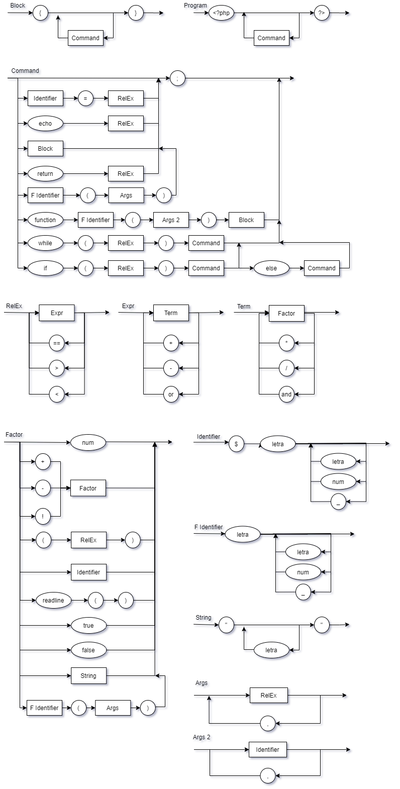

# Compilador

*Ultima atualizacao README.md: 13/05*

#### Compilador de .php

Keywords disponíveis:
- "\<?php ?\>"
- "{ }" bloco
- "$" variável
- "echo"
- "while"
- "if" e "else"
- "readline" (até v2.4)
- "function" (até v2.4)

Operadores disponíveis:
- "+"
- "-"
- "*"
- "/"
- "( )"
- "=="
- ">"
- "<"
- "or"
- "and"
- "!"
- "." concatenação (até v2.4)

Exemplo de uso:
> python compilador.py exemplo_entrada.php > programa.asm
> nasm -f elf32 -F dwarf -g program.asm
> ld -m elf_i386 -o program program.o

Diagrama sintático:



EBNF:
```
PROG = "<?php", {COMM}, "?>"
BLOC = "{", {COMM}, "}"
COMM = (IDEN, "=", EXPR, ";")
      | ("echo", EXPR, ";")
      | BLOC
      | ("while", "(", RELE, ")", COMM)
      | ("if", "(", RELE, ")", COMM)
      | ("if", "(", RELE, ")", COMM, "else", COMM)
      | ("return", RELE, ";")
      | (FIDE, "(", ARG1, ")", ";")
      | ("function", FIDE, "(", ARG2, ")", BLOC)
RELE = EXPR, {("=="|">"|"<"), EXPR}
EXPR = TERM, {("+"|"-"|"or"), TERM}
TERM = FACT, {("*"|"/"|"and"), FACT}
FACT = num
      | (("+"|"-"|"!"), FACT)
      | ( "(", RELE, ")" )
      | IDEN
      | ("readline", "(", ")")
      | "true"
      | "false"
      | STRG
      | (FIDE, "(", ARG1, ")", ";")
IDEN =  "$", letra, {( letra | num | "_" )}
STRG = '"', {letra}, '"'
FIDE = letra, {( letra | num | "_" )}
ARG1 = { (RELE, {",", RELE}) }
ARG2 = { (IDEN, {",", IDEN}) }
```
